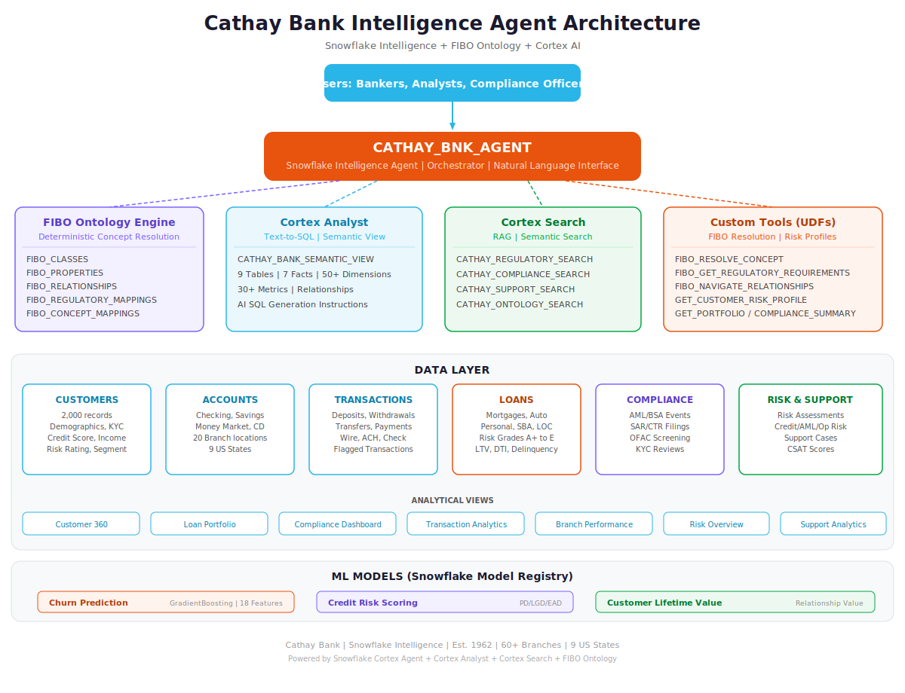
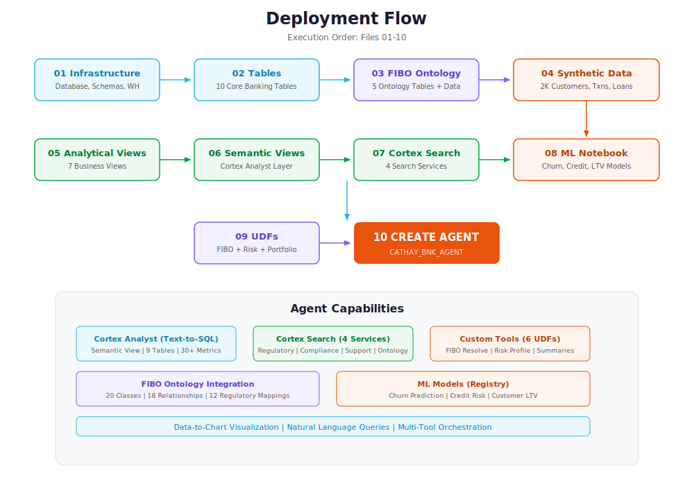
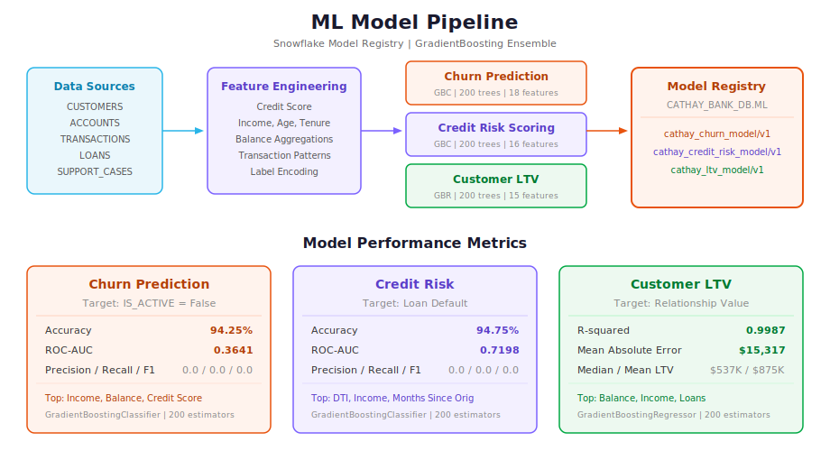

# Cathay Bank Intelligence Agent


**Inspiring Confidence, Enabling Dreams.**

A comprehensive Snowflake Intelligence Agent for Cathay Bank, the oldest operating American bank founded by Chinese Americans. This project implements a complete agentic AI architecture with FIBO ontology integration, Cortex Analyst text-to-SQL, Cortex Search for regulatory documents, and ML models for predictive analytics.

---

## Architecture



## Deployment Flow



## ML Pipeline



---

## Project Structure

<table>
<tr><th>Path</th><th>Description</th><th>Order</th></tr>
<tr><td><code>sql/setup/01_database_and_schema.sql</code></td><td>Database, schemas, and warehouse creation</td><td>1</td></tr>
<tr><td><code>sql/setup/02_create_tables.sql</code></td><td>10 core banking domain tables</td><td>2</td></tr>
<tr><td><code>sql/setup/03_Financial_Industry_Business_Ontology.sql</code></td><td>FIBO ontology tables and data (20 classes, 18 relationships, 12 regulatory mappings)</td><td>3</td></tr>
<tr><td><code>sql/data/04_generate_synthetic_data.sql</code></td><td>Synthetic data: 2K customers, accounts, transactions, loans, compliance events</td><td>4</td></tr>
<tr><td><code>sql/views/05_create_views.sql</code></td><td>7 analytical views (Customer 360, Loan Portfolio, Compliance Dashboard, etc.)</td><td>5</td></tr>
<tr><td><code>sql/views/06_create_semantic_views.sql</code></td><td>Semantic view with 9 tables, 50+ dimensions, 30+ metrics for Cortex Analyst</td><td>6</td></tr>
<tr><td><code>sql/search/07_create_cortex_search.sql</code></td><td>4 Cortex Search services (Regulatory, Compliance, Support, Ontology)</td><td>7</td></tr>
<tr><td><code>notebooks/08_ml_models.ipynb</code></td><td>ML notebook: Churn Prediction, Credit Risk, Customer LTV models</td><td>8</td></tr>
<tr><td><code>sql/models/09_ml_model_functions.sql</code></td><td>6 SQL UDFs: FIBO resolution, risk profiles, portfolio/compliance summaries</td><td>9</td></tr>
<tr><td><code>sql/agent/10_create_agent.sql</code></td><td>Agent creation with 11 tools (Analyst, 4 Search, 6 Custom)</td><td>10</td></tr>
</table>

---

## Key Components

### FIBO Ontology Integration
The Financial Industry Business Ontology (FIBO) provides deterministic concept resolution for the agent. When a user asks about "KYC" or "correspondent banking AML exposure," the ontology resolves domain concepts, maps regulatory frameworks, and identifies specific data elements before the LLM generates queries.

<table>
<tr><th>Component</th><th>Count</th><th>Coverage</th></tr>
<tr><td>FIBO Classes</td><td>20</td><td>Banking, Compliance, Risk, Regulatory, Clients</td></tr>
<tr><td>FIBO Relationships</td><td>18</td><td>HAS, GOVERNED_BY, REGULATED_BY, SUPPORTS, etc.</td></tr>
<tr><td>Regulatory Mappings</td><td>12</td><td>BSA, OFAC, Basel III, HMDA, CRA, TILA, ECOA, Reg E, FDIC</td></tr>
<tr><td>Concept Mappings</td><td>12</td><td>Maps concepts to Snowflake tables and columns</td></tr>
</table>

### Agent Tools

<table>
<tr><th>Tool</th><th>Type</th><th>Purpose</th></tr>
<tr><td>CathayBankAnalyst</td><td>cortex_analyst_text_to_sql</td><td>Natural language to SQL for all structured data queries</td></tr>
<tr><td>RegulatorySearch</td><td>cortex_search</td><td>Search regulatory documents and compliance policies</td></tr>
<tr><td>ComplianceSearch</td><td>cortex_search</td><td>Search compliance event records and investigations</td></tr>
<tr><td>SupportSearch</td><td>cortex_search</td><td>Search customer support cases and resolutions</td></tr>
<tr><td>OntologySearch</td><td>cortex_search</td><td>Search FIBO ontology knowledge base</td></tr>
<tr><td>FIBOResolveConcept</td><td>custom_tool</td><td>Resolve banking concepts via FIBO ontology</td></tr>
<tr><td>FIBORegulatoryRequirements</td><td>custom_tool</td><td>Look up regulatory framework requirements</td></tr>
<tr><td>FIBONavigateRelationships</td><td>custom_tool</td><td>Navigate ontology relationship graph</td></tr>
<tr><td>CustomerRiskProfile</td><td>custom_tool</td><td>Comprehensive customer risk profile</td></tr>
<tr><td>PortfolioSummary</td><td>custom_tool</td><td>Executive portfolio dashboard</td></tr>
<tr><td>ComplianceSummary</td><td>custom_tool</td><td>Compliance officer summary</td></tr>
</table>

### ML Models

<table>
<tr><th>Model</th><th>Algorithm</th><th>Target</th><th>Registry Path</th></tr>
<tr><td>Churn Prediction</td><td>GradientBoostingClassifier</td><td>Customer attrition</td><td>CATHAY_BANK_DB.ML.cathay_churn_model/v1</td></tr>
<tr><td>Credit Risk</td><td>GradientBoostingClassifier</td><td>Loan default</td><td>CATHAY_BANK_DB.ML.cathay_credit_risk_model/v1</td></tr>
<tr><td>Customer LTV</td><td>GradientBoostingRegressor</td><td>Relationship value</td><td>CATHAY_BANK_DB.ML.cathay_ltv_model/v1</td></tr>
</table>

---

## Quick Start

```sql
-- Execute files in order (01-10)
-- See docs/AGENT_SETUP.md for detailed instructions

-- After deployment, test the agent:
-- Navigate to Snowflake Intelligence in Snowsight
-- Select "Cathay Bank Assistant"
-- Ask: "What is our total deposit base and how is it distributed across account types?"
```

---

## Documentation

- [Agent Setup Guide](docs/AGENT_SETUP.md)
- [Deployment Summary](docs/DEPLOYMENT_SUMMARY.md)
- [Test Questions (30+)](docs/questions.md)

---

**Cathay Bank** | Established 1962 | Los Angeles, California | 60+ Branches | 9 US States
